<p align="center">
  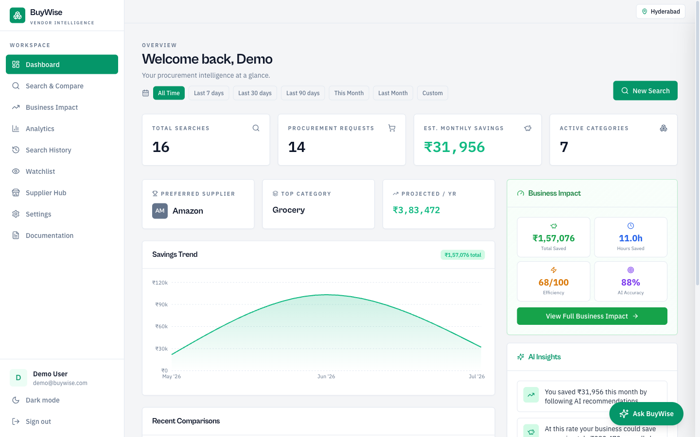
</p>

# 🚀 ProcureAI
### Intelligent Procurement Platform

> Procurement platform that combines an **explainable multi-factor decision engine** with an **AI procurement assistant** to help businesses make faster and smarter purchasing decisions.

- ✅ **Multi-factor Recommendation Engine** — 7 scoring dimensions, 6 procurement strategies, confidence scores
- ✅ **Procurement AI Assistant** — Conversational interface with backend function calling via Groq
- ✅ Compare online + offline suppliers in one search
- ✅ Split-cart basket optimization across all suppliers
- ✅ Build and manage a private Supplier Network
- ✅ Track procurement ROI with Business Impact Dashboard
- ✅ Natural-language explanations generated using Groq (Llama 3.3-70B)

[](https://github.com/Rakshitkulkarni223/ProcureAI)

---

## 💡 Why AI?

Traditional procurement tools help buyers collect supplier information, but evaluating suppliers, comparing trade-offs, and making procurement decisions is still largely manual.

ProcureAI combines:
- A **transparent multi-factor decision engine** for supplier evaluation
- A **conversational AI assistant** for procurement analysis
- **Backend tool calling** to retrieve real procurement data before generating responses
- **Grounded responses** that never invent supplier information

This allows buyers to interact with procurement data using natural language while keeping every recommendation explainable and auditable.

> Every recommendation is fully explainable — users can inspect the weighted score, confidence margin, trade-offs, and business reasoning behind each decision.

| Decision Engine | AI Assistant |
|---|---|
| Multi-factor weighted scoring | Groq (Llama 3.3-70B) |
| Deterministic & explainable | Conversational interface |
| Calculates supplier rankings | Explains recommendations |
| Produces confidence margins | Uses backend tool calling |
| Same input → same output | Natural language responses |

---

## 🌐 Live Demo

> Try ProcureAI right now — no setup required.

| | |
|---|---|
| **Production** | [https://buywise-compare-1.emergent.host](https://buywise-compare-1.emergent.host) |
| **Preview** | [https://buywise-compare-1.preview.emergentagent.com](https://buywise-compare-1.preview.emergentagent.com) |
| **Email** | `demo@procureai.com` |
| **Password** | `Demo@123` |

---

## ✨ Features

| Feature | Description |
|---------|-------------|
| **Compare Suppliers** | Search any product across marketplace and private suppliers — results normalized, scored, and ranked |
| **Supplier Network** | Register private suppliers and maintain their products, pricing, delivery, reliability, and commercial details. Network products appear alongside marketplace results. |
| **Basket Optimization** | Build a multi-item list, set an optional delivery cost per supplier, and compare split-cart and consolidation plans. |
| **Procurement AI Assistant** | Conversational AI panel on every page — ask questions, compare suppliers, optimize baskets, check savings via natural language |
| **Explanation Panel** | Radar chart + scoreboard + business reasoning for every recommendation — natural-language explanations generated using Groq |
| **6 Recommendation Modes** | Balanced, Lowest Cost, Lowest Risk, Fastest Delivery, Highest Reliability, Best Long-Term Value |
| **Location-Aware Delivery** | Same city → 1 day, same state → 2 days, different state → 4–5 days |
| **Business Impact Dashboard** | Savings, hours saved, efficiency score, projected annual savings — with date range filtering |
| **Business Impact Calculator** | Interactive sliders — estimate monthly hours saved, salary savings, annual cost reduction |
| **Export Reports** | CSV and styled PDF export from comparison results |
| **Price Watchlist** | Track prices and set target alerts across sessions |
| **Search History** | Paginated per-user log with basket entries tagged |
| **Workspace Experience** | Dark-first authenticated workspace with responsive navigation, protected routes, an application tab icon, and no user-facing theme switch. |

---

## 🧭 Current Product Workflows

### Authentication and workspace

- **Create an account or sign in** with JWT-backed authentication. The login screen also provides a **Try Demo Workspace** action using the configured demo account.
- **Protected routes** keep dashboard, search, analytics, history, settings, watchlist, business impact, Supplier Network, and documentation data scoped to the signed-in user.
- **Workspace defaults** include category, sort order, business type, and delivery location. Delivery location is applied to distance-aware estimates in searches and basket optimization.

### Search and decision support

- **Single Search** compares selected marketplace and Supplier Network suppliers in parallel. Results support sorting, in-stock and rating filters, CSV/PDF export, and price watchlist actions.
- **Basket Optimisation** accepts multiple items and quantities, optionally applies a delivery cost per supplier, then recommends a split-cart or consolidation plan. The result includes assignments, total cost, baseline comparison, savings, delivery window, risk, confidence, and supplier intelligence.
- **AI decision support** exposes recommendation reasoning, factor scores, supplier comparison matrix, procurement health, long-term recommendation, supplier intelligence, and grounded advisory insights when data is available.

### Tracking and assistance

- **Watchlist** persists tracked products locally in the browser. You can edit a target price, identify products at or below target, open the supplier listing, or clear the list.
- **History** stores single searches and basket optimisations per authenticated user, with pagination, expansion, rerun, and delete actions.
- **Analytics and Business Impact** support date-range filtering for procurement value, savings, category spend, supplier activity, and ROI projections.
- **ProcureAI Advisor** supports streaming, grounded chat responses, conversation history, new conversations, and deletion of saved conversations.

---

## 📸 Screenshots

| Dashboard | Compare Suppliers | AI Explanation |
|---|---|---|
|  | 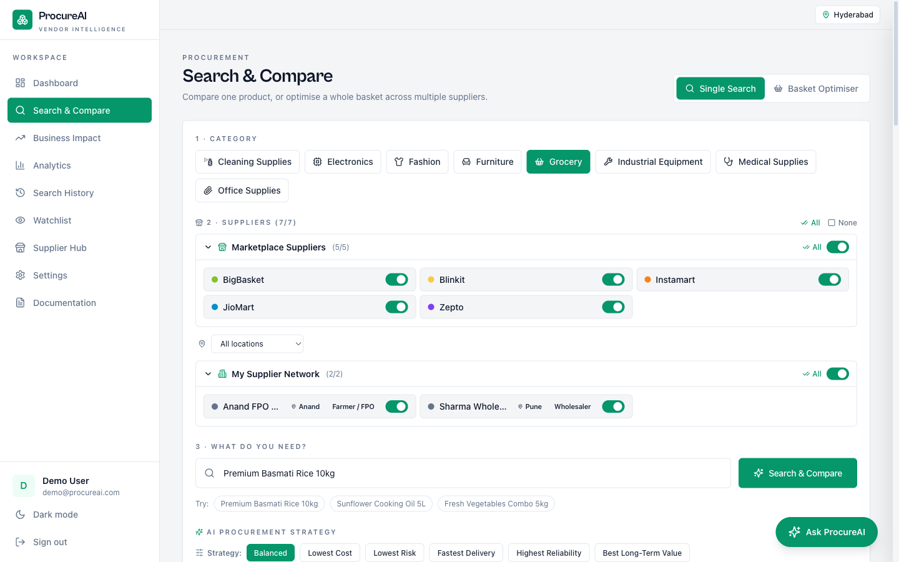 | 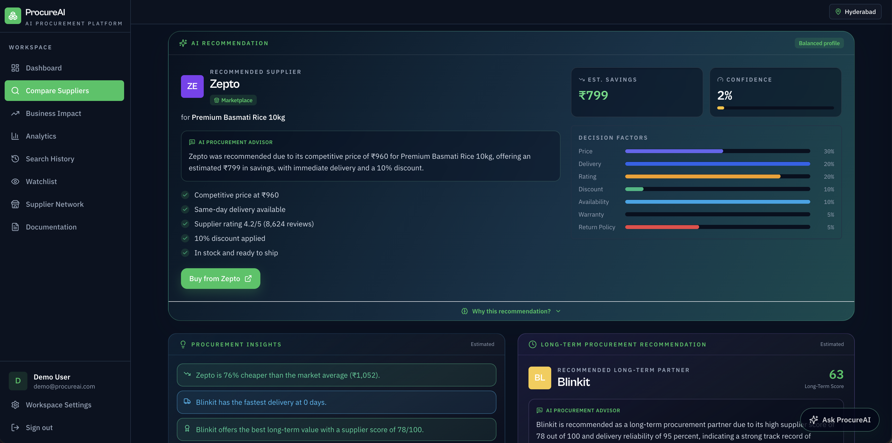 |

| Basket Optimization | AI Assistant | Supplier Network |
|---|---|---|
| 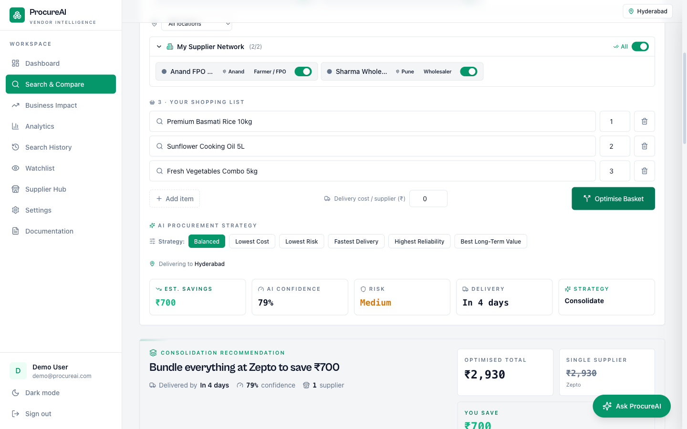 | 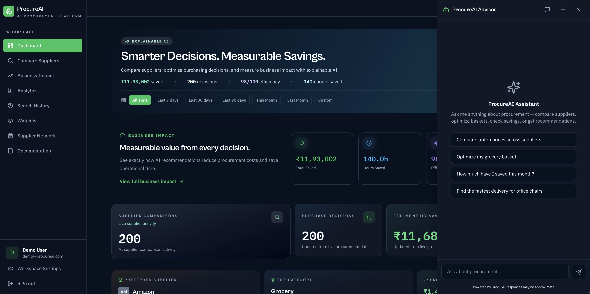 | 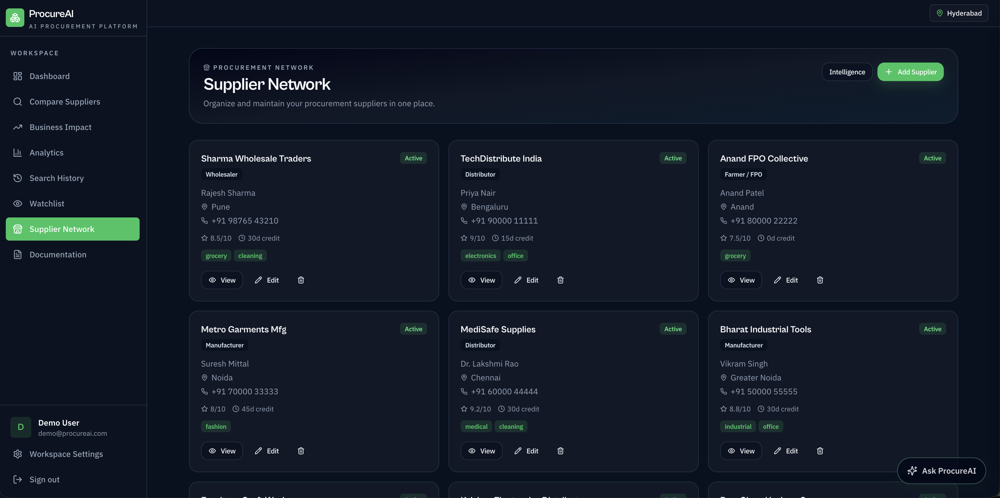 |

<details>
<summary>More screenshots</summary>

| Business Impact | Analytics | Search History |
|---|---|---|
| 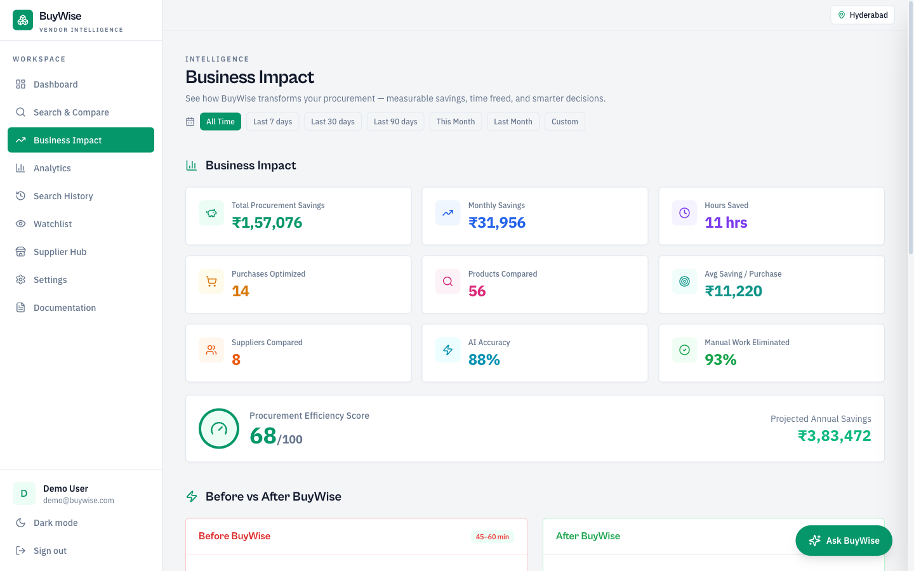 | 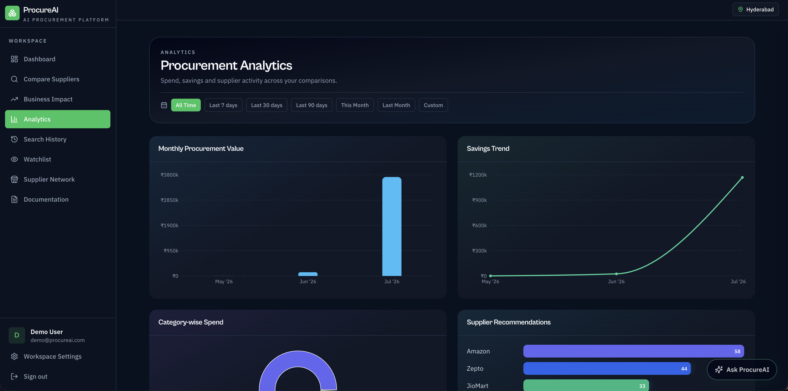 | 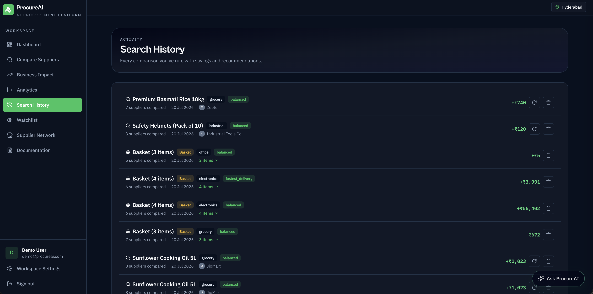 |

| Watchlist | Settings | Documentation |
|---|---|---|
| 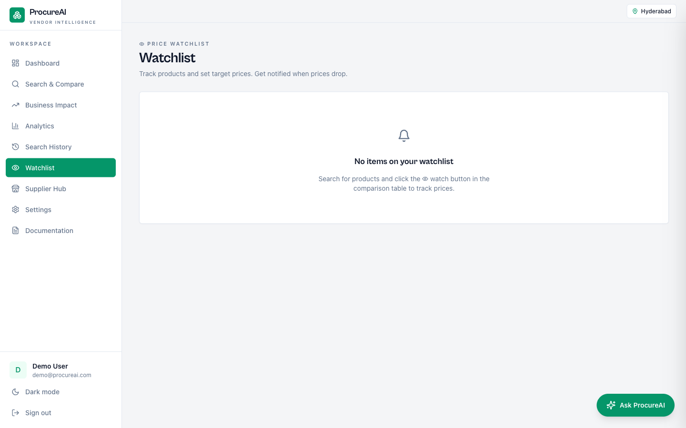 | 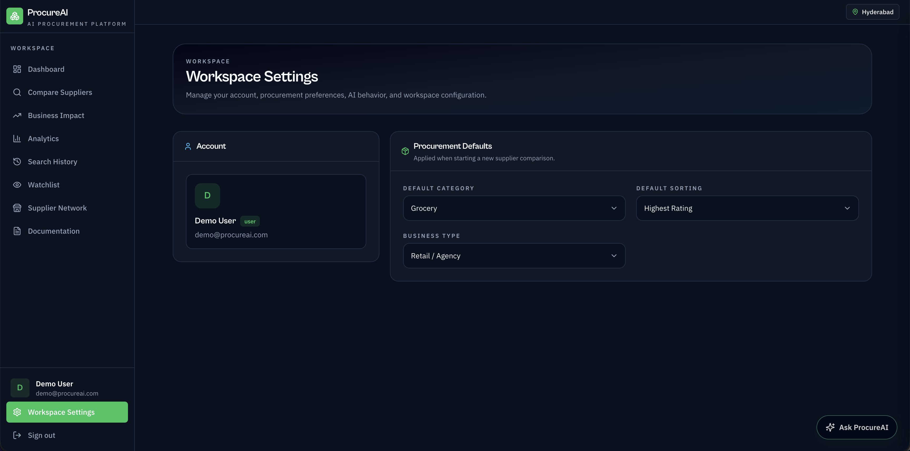 | 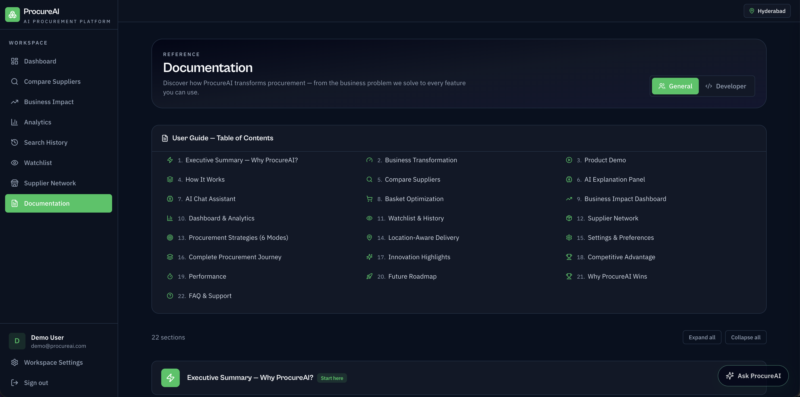 |

</details>

---

## 🤖 AI Assistant

The Procurement AI Assistant is a conversational interface powered by **Groq** (Llama 3.3-70B / Llama 3.1-8B) with backend function calling. It accesses live procurement data through 8 tools:

| Tool | What It Does |
|---|---|
| **Product Search** | Searches the catalog across marketplace + Supplier Network suppliers |
| **Supplier Comparison** | Gets multi-factor scored recommendations with confidence levels and trade-off analysis |
| **Basket Optimization** | Optimizes multi-item procurement across suppliers for cost, delivery, or reliability |
| **Analytics** | Retrieves spend analytics, savings trends, and procurement insights |
| **Business Impact** | Shows ROI metrics, hours saved, efficiency scores, and annual projections |
| **Supplier Network** | Lists the user's private suppliers with delivery and reliability data |
| **Search History** | Retrieves past procurement search history |
| **Basket History** | Retrieves past basket optimizations with actual items and results |

**Grounded responses:** The AI only reports data returned by backend tools — supplier names, prices, and delivery times are never fabricated. Items not found in the catalog are explicitly flagged.

**Conversation memory:** All chats are persisted in MongoDB with full CRUD (create, list, resume, rename, delete).

> Every AI response is grounded in backend tool results and references the same supplier data used by the recommendation engine, ensuring consistency between the interface and AI assistant.

---

## ️ System Design

```
┌─────────────────────────────────────────┐
│           React SPA (Browser)           │
│  Dashboard │ Search │ Hub │ Impact │ …  │
└──────────────────┬──────────────────────┘
                   │ Axios / HTTP JSON
┌──────────────────┼──────────────────────┐
│          FastAPI Backend (Python)        │
│                  │                       │
│   ┌──────────────┴──────────────┐       │
│   │  Multi-factor Recommendation │       │
│   │       Engine (6 modes)       │       │
│   └──────┬───────────┬──────────┘       │
│          │           │                   │
│  ┌───────┴───┐ ┌─────┴──────┐           │
│  │Marketplace│ │ Supplier   │           │
│  │ Adapter   │ │Hub Adapter │           │
│  └───────┬───┘ └─────┬──────┘           │
│          │           │                   │
│  ┌───────┴───┐ ┌─────┴──────┐           │
│  │  SerpAPI  │ │ Groq LLM   │           │
│  │ Adapter   │ │(Llama 3.3/ │           │
│  │(optional) │ │ Llama 3.1) │           │
│  └───────────┘ └────────────┘           │
│                                          │
│   ┌───────────────────────────┐      │
│   │  Procurement AI Assistant   │      │
│   │  • 8 function-calling tools │      │
│   │  • Conversation memory      │      │
│   │  • Grounded responses       │      │
│   └───────────────────────────┘      │
│          │                               │
│   ┌──────┴───────────────────────┐      │
│   │  Services (Motor async)      │      │
│   └──────────────┬───────────────┘      │
└──────────────────┼──────────────────────┘
                   │
           ┌───────┴───────┐
           │    MongoDB    │
           │ (Atlas/Local) │
           └───────────────┘
```

The recommendation engine and AI assistant are intentionally separated. Procurement decisions are produced by the deterministic scoring engine, while the AI assistant explains results, answers questions, and orchestrates backend tools without modifying recommendation logic.

---

## 🎯 Design Principles

- **Explainable recommendations** over black-box predictions
- **AI assists** procurement decisions rather than replacing them
- **Backend tool calling** ensures grounded responses
- **Deterministic scoring** guarantees reproducible recommendations
- **Modular architecture** allows additional suppliers, tools, and AI models

---

## 🛠️ Tech Stack

| Layer | Technology |
|-------|-----------|
| **Frontend** | React 18, TypeScript, TailwindCSS, React Router v6, Recharts, Framer Motion, Lucide |
| **Backend** | Python 3.13, FastAPI, Pydantic, Uvicorn |
| **Database** | MongoDB with Motor (async driver) |
| **Auth** | JWT (PyJWT) + bcrypt |
| **Decision Engine** | Multi-factor weighted scoring (7 dimensions, 6 configurable strategies) |
| **AI Assistant** | Groq (Llama 3.3-70B) with automatic fallback to Llama 3.1-8B |
| **Tool Calling** | OpenAI-compatible function calling — 8 procurement tools |
| **Conversation Memory** | MongoDB-persisted per-user chat history |
| **Grounding** | Backend procurement tools — AI never generates data independently |
| **Optional** | SerpAPI (live Google Shopping) |

---

## ⚡ Performance

- Async supplier search — concurrent adapter execution via `asyncio.gather`
- Error isolation — individual supplier failures don't block the search
- MongoDB indexing on frequently queried fields
- Stateless JWT auth — no session storage
- Lazy-loaded React routes — code-split per page
- Fire-and-forget history persistence — non-blocking writes

---

## 🔒 Security

- JWT authentication with configurable expiry (PyJWT)
- bcrypt password hashing (12 salt rounds)
- Protected API endpoints — bearer token required
- Input validation via Pydantic models on every request
- Environment variable secrets — no hardcoded credentials
- CORS configuration per environment (FastAPI CORSMiddleware)

---

## 🧩 Engineering Challenges

- Unified different supplier response schemas using the **Adapter Pattern**
- Balanced weighted scoring across **7 procurement factors** with configurable weight profiles
- Implemented **split-cart optimization** — finds cheapest multi-item combination across suppliers
- Designed an **explainable procurement decision engine** with configurable weighted scoring, confidence metrics, and transparent trade-off analysis
- **Location-aware delivery estimation** — city/state distance-based delivery days
- Async aggregation with **error isolation** — one failing supplier doesn't break the search
- **Procurement AI Assistant** with backend function calling — 8 tools, multi-turn conversations, grounded responses
- Groq LLM integration (Llama 3.3-70B) with automatic fallback to Llama 3.1-8B, then rule-based explanations
- **Conversation memory** persisted in MongoDB with per-user scoping and auto-cleanup
- Separation of **deterministic scoring** (decision engine) from **generative AI** (explanations + chat)

---

## 🚀 Setup

### Prerequisites

- Python >= 3.11 · Node.js >= 18.x · MongoDB (local or Atlas)

### Quick Start

```bash
# Clone
git clone https://github.com/Rakshitkulkarni223/ProcureAI.git
cd ProcureAI

# Backend
cd backend && pip install -r requirements.txt

# Frontend
cd ../frontend && npm install
```

### Environment Variables

```env
# backend/.env
MONGO_URL=mongodb+srv://<user>:<pass>@cluster.mongodb.net
DB_NAME=procureai
JWT_SECRET=your-secret-key
JWT_EXPIRES_IN=7d
PORT=8001
DEMO_EMAIL=demo@procureai.com
DEMO_PASSWORD=Demo@123
DEMO_NAME=Demo User
CORS_ORIGINS=*
SERPAPI_KEY=                    # Optional — live Google Shopping (free: serpapi.com)
GROQ_API_KEY=                  # AI Assistant — free at https://console.groq.com
AI_PRIMARY_MODEL=llama-3.3-70b-versatile    # Optional — default: llama-3.3-70b-versatile
AI_FALLBACK_MODEL=llama-3.1-8b-instant     # Optional — default: llama-3.1-8b-instant
AI_TEMPERATURE=0.3             # Optional — default: 0.3
AI_MAX_TOKENS=1024             # Optional — default: 1024

# frontend/.env
REACT_APP_BACKEND_URL=http://localhost:8001
```

### Run

```bash
# Backend
cd backend && uvicorn server:app --host 0.0.0.0 --port 8001 --reload

# Frontend
cd frontend && npm start
```

### Tests

```bash
cd backend && python -m pytest tests/backend_test.py -v
```

---

## 🗺️ Future Roadmap

| Phase | Feature |
|-------|---------|
| **✅ Done** | AI Chat Assistant (Groq) · Function calling with 8 tools · Conversation memory · Anti-hallucination guardrails |
| **✅ Available (Optional)** | Live Google Shopping prices via SerpAPI |
| **P1** | Amazon/Udaan/Metro APIs · Live Supplier Quotes · ERP Integration · WhatsApp Quotes |
| **P2** | Invoice OCR · AI Negotiation · Approval Workflows · Predictive Procurement using historical purchasing trends |
| **P3** | Inventory Sync · Supplier Scorecards · Supplier Performance Forecasting · RAG over procurement docs |
| **Future** | Multi-currency · Mobile App · Voice procurement |

---

## 🏅 Highlights

- ✅ **Procurement AI Assistant** — Conversational interface with 8 backend function-calling tools
- ✅ **Grounded AI responses** — The assistant answers only from backend procurement data and clearly reports when information is unavailable
- ✅ **Explainable decisions** — Weighted scores, confidence margins, and business reasoning for every recommendation
- ✅ **Conversation memory** — MongoDB-persisted, per-user, with auto-cleanup
- ✅ 45+ REST API endpoints (including AI chat + conversations CRUD)
- ✅ React + FastAPI full-stack architecture
- ✅ JWT authentication with bcrypt
- ✅ Async MongoDB backend (Motor)
- ✅ Multi-factor decision engine (7 scoring dimensions)
- ✅ 6 configurable procurement strategies
- ✅ Split-cart basket optimization algorithm
- ✅ Supplier Network — private supplier management
- ✅ Business Impact Dashboard + Business Impact Calculator
- ✅ PDF & CSV export
- ✅ Location-aware delivery estimation
- ✅ Responsive dark-first workspace
- ✅ Built-in interactive documentation

---

## 📚 Documentation

| Document | Description |
|----------|-------------|
| [docs/API.md](docs/API.md) | Full API reference — all endpoints with auth requirements |
| [docs/ARCHITECTURE.md](docs/ARCHITECTURE.md) | System design, scoring pipeline, recommendation modes, workflow diagrams |
| [docs/DESIGN.md](docs/DESIGN.md) | Project structure, design decisions, conventions, data model |

---

<p align="center">
  <b>ProcureAI</b> — Transforming procurement from price comparison to intelligent, explainable decision-making.<br/>
  <a href="https://github.com/Rakshitkulkarni223/ProcureAI">GitHub</a>
</p>
