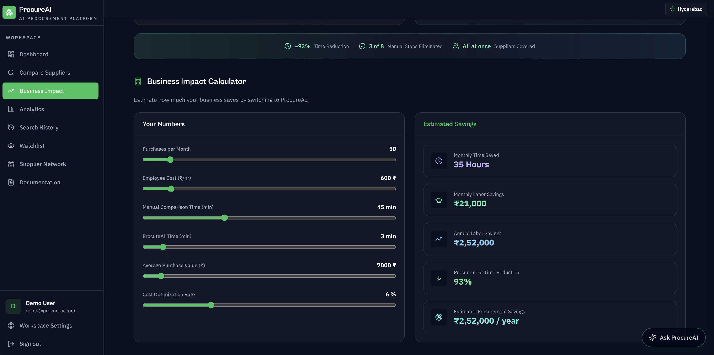

<p align="center">
  
</p>

# 🚀 ProcureAI — Procurement Decision Intelligence Platform

> AI-powered procurement intelligence platform. Compare suppliers, optimize baskets, and get natural language recommendations — all from a single interface.

- ✅ **AI Procurement Assistant** — Chat with an AI advisor powered by Groq (function calling + 8 tools)
- ✅ Compare online + offline suppliers in one search
- ✅ Multi-factor recommendation engine with confidence scores
- ✅ 6 procurement strategies for different business goals
- ✅ Split-cart basket optimization across all suppliers
- ✅ Build a private supplier network (Supplier Hub)
- ✅ Track procurement ROI with Business Impact Dashboard
- ✅ AI-generated explanations for every recommendation

[](https://github.com/Rakshitkulkarni223/ProcureAI)

---

## 🌐 Live Demo

> Try ProcureAI right now — no setup required.

| | |
|---|---|
| **Production** | [https://buywise-compare-1.emergent.host](https://buywise-compare-1.emergent.host) |
| **Preview** | [https://buywise-compare-1.preview.emergentagent.com](https://buywise-compare-1.preview.emergentagent.com) |
| **Email** | `demo@procureai.com` |
| **Password** | `Demo@123` |

---

## ✨ Features

| Feature | Description |
|---------|-------------|
| **Product Search** | Search any product across marketplace and private suppliers — results normalized, scored, and ranked |
| **Supplier Hub** | Register offline suppliers with products, pricing, and delivery info — they appear in every search |
| **Basket Optimization** | Split-cart optimizer finds the cheapest multi-item combination across suppliers |
| **AI Chat Assistant** | Floating AI panel on every page — ask questions, compare suppliers, optimize baskets, check savings via natural language |
| **Explanation Panel** | Radar chart + scoreboard + business reasoning for every recommendation (AI-generated via Groq) |
| **6 Recommendation Modes** | Balanced, Lowest Cost, Lowest Risk, Fastest Delivery, Highest Reliability, Best Long-Term Value |
| **Location-Aware Delivery** | Same city → 1 day, same state → 2 days, different state → 4–5 days |
| **Business Impact Dashboard** | Savings, hours saved, efficiency score, projected annual savings — with date range filtering |
| **ROI Calculator** | Interactive sliders — estimate monthly hours saved, salary savings, annual cost reduction |
| **Export Reports** | CSV and styled PDF export from comparison results |
| **Price Watchlist** | Track prices and set target alerts across sessions |
| **Search History** | Paginated per-user log with basket entries tagged |
| **Dark Mode** | Full light/dark theme support with CSS variable theming |

---

## 📸 Screenshots

| Dashboard | Search & Compare | Explanation Panel |
|---|---|---|
|  |  |  |

| Basket Optimization | Business Impact | ROI Calculator |
|---|---|---|
|  |  |  |

<details>
<summary>More screenshots</summary>

| Analytics | Search History | Watchlist |
|---|---|---|
|  |  |  |

| Settings | Documentation |
|---|---|
|  |  |

</details>

---

## 🤖 AI Assistant

The AI Procurement Assistant is a conversational interface powered by **Groq** (Qwen3-32B / Llama 3.3-70B) with function calling. It can:

| Capability | How It Works |
|---|---|
| **Product Search** | Searches the catalog across marketplace + Supplier Hub suppliers |
| **Recommendations** | Gets AI-scored recommendations with confidence levels and trade-off analysis |
| **Basket Optimization** | Optimizes multi-item procurement across suppliers for cost, delivery, or reliability |
| **Analytics & Insights** | Retrieves spend analytics, savings trends, and procurement insights |
| **Business Impact** | Shows ROI metrics, hours saved, efficiency scores, and annual projections |
| **Supplier Hub** | Lists the user's private suppliers with delivery and reliability data |
| **History** | Retrieves past searches and basket optimizations with real data |
| **Multi-Category** | Handles cross-category queries (e.g. "laptop and rice") with parallel tool calls |

**Anti-hallucination guardrails:** The AI only reports data from tool results — supplier names, prices, and delivery times are never fabricated. Items not found in the catalog are explicitly flagged.

**Conversation memory:** All chats are persisted in MongoDB with full CRUD (create, list, resume, rename, delete).

---

## 🎬 Demo Video

> Full walkthrough: Login → Dashboard → Business Impact → Search & Compare → Basket Optimizer → Analytics → History → Watchlist → Settings → Docs → Dark Mode

[Demo Video](https://github.com/user-attachments/assets/80705382-ff09-4438-9ee8-7c09f00f426b)

<details>
<summary>Can't see the video? Click to expand.</summary>

Download from [`demo/procureai-demo.mp4`](demo/procureai-demo.mp4) and play locally.

</details>

---

## 🏗️ System Design

```
┌─────────────────────────────────────────┐
│           React SPA (Browser)           │
│  Dashboard │ Search │ Hub │ Impact │ …  │
└──────────────────┬──────────────────────┘
                   │ Axios / HTTP JSON
┌──────────────────┼──────────────────────┐
│          FastAPI Backend (Python)        │
│                  │                       │
│   ┌──────────────┴──────────────┐       │
│   │  Multi-factor Recommendation │       │
│   │       Engine (6 modes)       │       │
│   └──────┬───────────┬──────────┘       │
│          │           │                   │
│  ┌───────┴───┐ ┌─────┴──────┐           │
│  │Marketplace│ │ Supplier   │           │
│  │ Adapter   │ │Hub Adapter │           │
│  └───────┬───┘ └─────┬──────┘           │
│          │           │                   │
│  ┌───────┴───┐ ┌─────┴──────┐           │
│  │  SerpAPI  │ │ Groq LLM   │           │
│  │ Adapter   │ │ Advisor    │           │
│  │(optional) │ │ (Qwen3/    │           │
│  └───────────┘ │ Llama 3.3) │           │
│                 └────────────┘           │
│                                          │
│   ┌───────────────────────────┐      │
│   │  AI Chat Service            │      │
│   │  • 8 function-calling tools │      │
│   │  • Conversation memory      │      │
│   │  • Anti-hallucination       │      │
│   └───────────────────────────┘      │
│          │                               │
│   ┌──────┴───────────────────────┐      │
│   │  Services (Motor async)      │      │
│   └──────────────┬───────────────┘      │
└──────────────────┼──────────────────────┘
                   │
           ┌───────┴───────┐
           │    MongoDB    │
           │ (Atlas/Local) │
           └───────────────┘
```

---

## 🛠️ Tech Stack

| Layer | Technology |
|-------|-----------|
| **Frontend** | React 18, TypeScript, TailwindCSS, React Router v6, Recharts, Framer Motion, Lucide |
| **Backend** | Python 3.13, FastAPI, Pydantic, Uvicorn |
| **Database** | MongoDB with Motor (async driver) |
| **Auth** | JWT (PyJWT) + bcrypt |
| **AI Layer** | Groq API (Qwen3-32B / Llama 3.3-70B), OpenAI-compatible function calling, 8 procurement tools |
| **Optional** | SerpAPI (live Google Shopping) |

---

## ⚡ Performance

- Async supplier search — concurrent adapter execution via `asyncio.gather`
- Error isolation — individual supplier failures don't block the search
- MongoDB indexing on frequently queried fields
- Stateless JWT auth — no session storage
- Lazy-loaded React routes — code-split per page
- Fire-and-forget history persistence — non-blocking writes

---

## 🔒 Security

- JWT authentication with configurable expiry (PyJWT)
- bcrypt password hashing (12 salt rounds)
- Protected API endpoints — bearer token required
- Input validation via Pydantic models on every request
- Environment variable secrets — no hardcoded credentials
- CORS configuration per environment (FastAPI CORSMiddleware)

---

## 🧩 Engineering Challenges

- Unified different supplier response schemas using the **Adapter Pattern**
- Balanced weighted scoring across **7 procurement factors** with configurable weight profiles
- Implemented **split-cart optimization** — finds cheapest multi-item combination across suppliers
- Built **explainable recommendations** — confidence scores, radar charts, and business reasoning
- **Location-aware delivery estimation** — city/state distance-based delivery days
- Async aggregation with **error isolation** — one failing supplier doesn't break the search
- **AI Chat Assistant** with function calling — 8 tools, multi-turn conversations, anti-hallucination guardrails
- Groq LLM integration (Qwen3-32B) with automatic fallback to Llama 3.3-70B, then rule-based explanations
- **Conversation memory** persisted in MongoDB with per-user scoping and auto-cleanup

---

## 🚀 Setup

### Prerequisites

- Python >= 3.11 · Node.js >= 18.x · MongoDB (local or Atlas)

### Quick Start

```bash
# Clone
git clone https://github.com/Rakshitkulkarni223/ProcureAI.git
cd ProcureAI

# Backend
cd backend && pip install -r requirements.txt

# Frontend
cd ../frontend && npm install
```

### Environment Variables

```env
# backend/.env
MONGO_URL=mongodb+srv://<user>:<pass>@cluster.mongodb.net
DB_NAME=procureai
JWT_SECRET=your-secret-key
JWT_EXPIRES_IN=7d
PORT=8001
DEMO_EMAIL=demo@procureai.com
DEMO_PASSWORD=Demo@123
DEMO_NAME=Demo User
CORS_ORIGINS=*
SERPAPI_KEY=                    # Optional — live Google Shopping (free: serpapi.com)
GROQ_API_KEY=                  # AI Assistant — free at https://console.groq.com
AI_PRIMARY_MODEL=qwen/qwen3-32b        # Optional — default: qwen/qwen3-32b
AI_FALLBACK_MODEL=llama-3.3-70b-versatile  # Optional — default: llama-3.3-70b
AI_TEMPERATURE=0.3             # Optional — default: 0.3
AI_MAX_TOKENS=1024             # Optional — default: 1024

# frontend/.env
REACT_APP_BACKEND_URL=http://localhost:8001
```

### Run

```bash
# Backend
cd backend && uvicorn server:app --host 0.0.0.0 --port 8001 --reload

# Frontend
cd frontend && npm start
```

### Tests

```bash
cd backend && python -m pytest tests/backend_test.py -v
```

---

## 🗺️ Future Roadmap

| Phase | Feature |
|-------|---------|
| **✅ Done** | AI Chat Assistant (Groq) · Function calling with 8 tools · Conversation memory · Anti-hallucination guardrails |
| **✅ Available (Optional)** | Live Google Shopping prices via SerpAPI |
| **P1** | Amazon/Udaan/Metro APIs · Live Supplier Quotes · ERP Integration · WhatsApp Quotes |
| **P2** | Invoice OCR · AI Negotiation · Approval Workflows · Predictive Procurement |
| **P3** | Inventory Sync · Supplier Scorecards · RAG over procurement docs |
| **Future** | Multi-currency · Mobile App · Voice procurement |

---

## 🏅 Highlights

- ✅ **AI Chat Assistant** — Groq-powered with 8 function-calling tools
- ✅ **Anti-hallucination** — 21 strict rules, prompt injection detection, exact-data-only responses
- ✅ **Conversation memory** — MongoDB-persisted, per-user, with auto-cleanup
- ✅ 45+ REST API endpoints (including AI chat + conversations CRUD)
- ✅ React + FastAPI full-stack architecture
- ✅ JWT authentication with bcrypt
- ✅ Async MongoDB backend (Motor)
- ✅ Multi-factor decision engine (7 scoring dimensions)
- ✅ 6 configurable procurement strategies
- ✅ Split-cart basket optimization algorithm
- ✅ Supplier Hub — private supplier management
- ✅ Business Impact Dashboard + ROI Calculator
- ✅ PDF & CSV export
- ✅ Location-aware delivery estimation
- ✅ Responsive UI with dark mode
- ✅ Built-in interactive documentation

---

## 📚 Documentation

| Document | Description |
|----------|-------------|
| [docs/API.md](docs/API.md) | Full API reference — all endpoints with auth requirements |
| [docs/ARCHITECTURE.md](docs/ARCHITECTURE.md) | System design, scoring pipeline, recommendation modes, workflow diagrams |
| [docs/DESIGN.md](docs/DESIGN.md) | Project structure, design decisions, conventions, data model |

---

<p align="center">
  <b>ProcureAI</b> — Transforming procurement from comparing prices to making intelligent business decisions.<br/>
  <a href="https://github.com/Rakshitkulkarni223/ProcureAI">GitHub</a>
</p>
